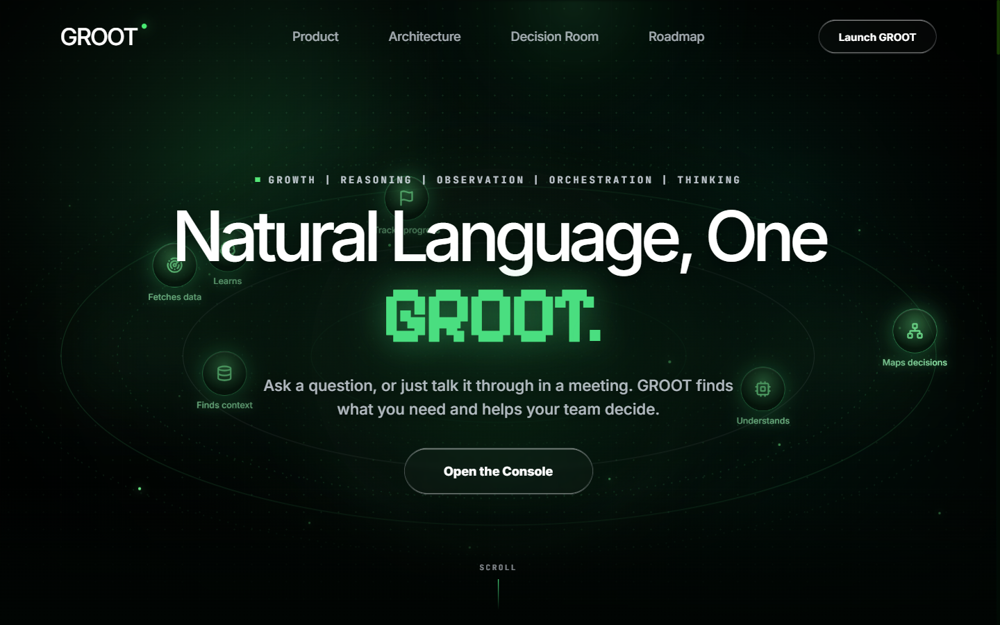
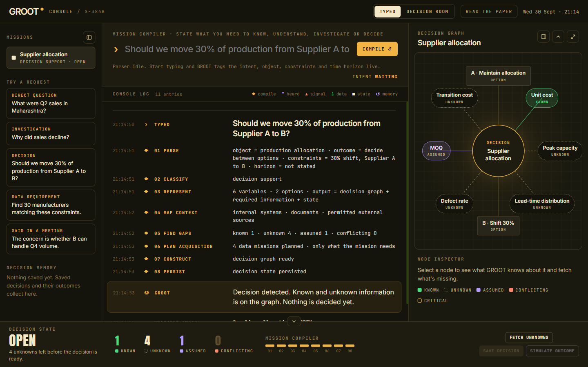
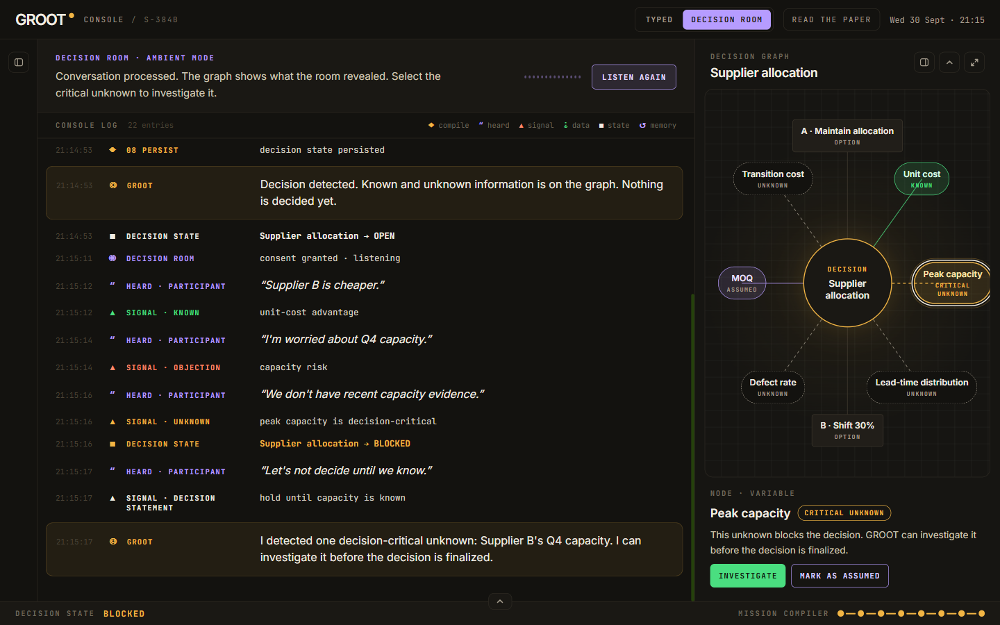
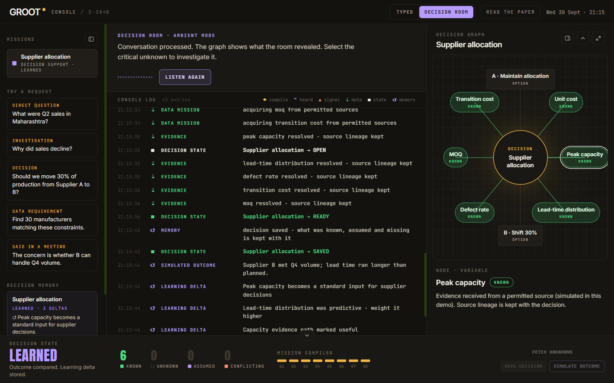
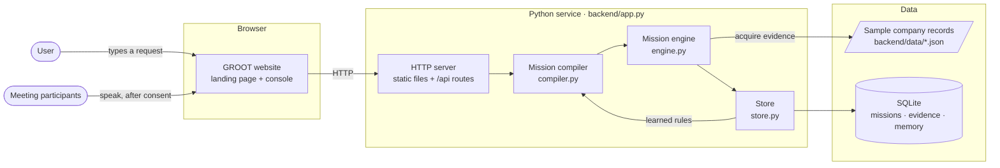
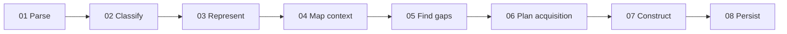
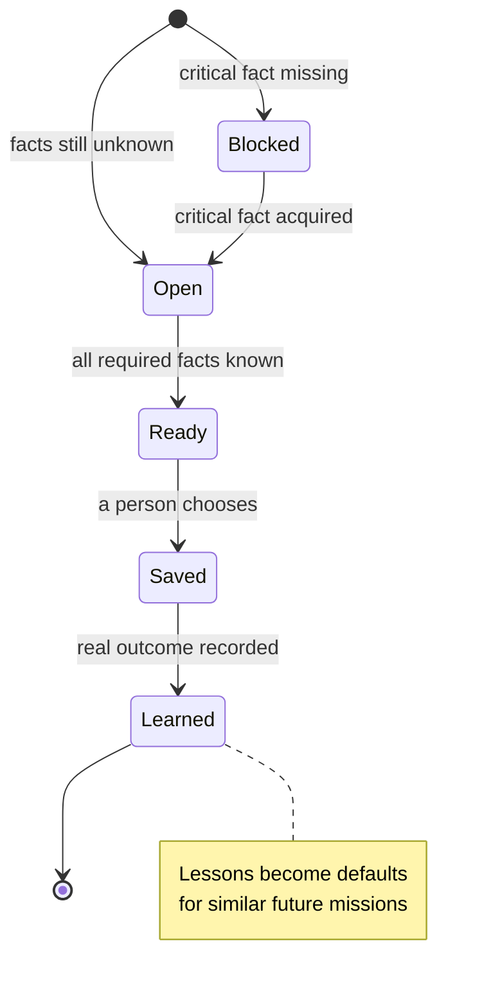
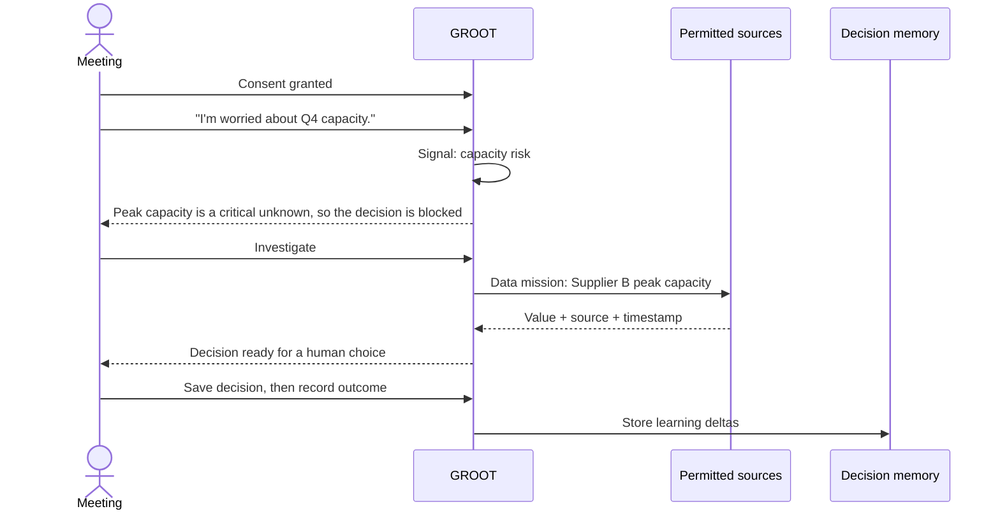

<div align="center">

# GROOT

**Natural language in. Intelligence missions out.**

GROOT turns a plain-English business request, typed or said in a meeting, into a structured **intelligence mission**. It finds what is known, flags what is missing, gathers source-backed evidence from permitted sources, and remembers how past decisions turned out.

[](https://groot-prototype.onrender.com)
[](#team)
[](#honest-limitations)
[](https://www.python.org/)
[](LICENSE)

**[Open the live prototype →](https://groot-prototype.onrender.com)**

<sub>Hosted on Render's free plan: the first load after a quiet period can take 30–60 seconds.</sub>

</div>



---

## The problem

Businesses constantly need specific information: sales figures, supplier facts, lists of manufacturers or leads. Today, each new need usually means a new scraper, spreadsheet or one-off workflow. That is slow to build, hard to maintain and does not scale.

The Track 01 challenge asks for a platform where a user **describes what they need in plain English**, and the system understands the request, builds and runs the right data-collection workflow on permitted sources, validates the results, and presents them in one dashboard.

## Our approach

GROOT treats every request as a **mission**, not a chat message. A mission compiler works out what kind of request it is, then switches on only the steps that request needs:

| Request type | Example | What GROOT produces |
| --- | --- | --- |
| **Direct question** | *What were Q2 sales in Maharashtra?* | An answer grounded in permitted data |
| **Investigation** | *Why did sales decline?* | A hypothesis and evidence map |
| **Decision** | *Should we move 30% of production from Supplier A to B?* | A decision graph of known, unknown, assumed and conflicting facts |
| **Data requirement** | *Find 30 manufacturers matching these constraints.* | A structured, source-backed dataset |
| **Said in a meeting** | *The concern is whether B can handle Q4 volume.* | An update to the live decision, heard in the Decision Room |

Three ideas set GROOT apart from a chat assistant:

1. **Transparent state, not a single answer.** Every fact on the decision graph carries a status and a source, and nothing is decided until a person decides it.
2. **Decision Room.** With participants' consent, GROOT listens for questions a meeting is *implicitly* asking and updates the same mission.
3. **Decision memory.** Saved decisions and their real outcomes feed future missions. For example, "peak capacity" becomes a standard input for supplier decisions after it mattered once.

---

## Prototype walkthrough

### 1. Compile a request into a mission

The console shows each mission-compiler step as it runs. The decision graph maps what is known (green), unknown (dashed), assumed (violet) and conflicting (red). The Decision State bar tracks progress.



### 2. Let the meeting ask the question

In **Decision Room** mode (only after consent), statements such as *"I'm worried about Q4 capacity"* become signals. GROOT spots the decision-critical unknown and blocks the decision until it is resolved.



### 3. Fetch unknowns, decide, and learn

**Fetch unknowns** runs data missions against permitted sources and keeps each fact's source lineage. A person saves the decision, the outcome is recorded, and the lessons land in **Decision memory** for next time.



---

## Architecture

The prototype runs as **one small Python service** that serves both the website and a JSON API from the same address. It needs no third-party Python packages.



| Layer | Role in the prototype |
| --- | --- |
| **Website** (`GROOT.dc.html`) | Landing page and interactive console: mission list, console log, decision graph, node inspector and decision state. |
| **Mission compiler** (`compiler.py`) | Rule-based and deterministic. Classifies a prompt, extracts constraints and builds the mission's variables. |
| **Mission engine** (`engine.py`) | Runs missions, gathers evidence from permitted sources, blocks decisions with missing critical facts, and records outcomes. |
| **Store** (`store.py`) | Saves missions, evidence, Decision Room sessions and decision memory in SQLite. |
| **Sample records** (`data/*.json`) | Fictional suppliers, sales, manufacturers and sources, each with a `permitted` flag. |

---

## How a request flows

### The mission compiler pipeline

Every request passes through the same eight steps. Steps a request does not need are skipped and shown as dashed in the UI; for example, a direct question does not build a decision graph.



| Step | What happens |
| --- | --- |
| **01 Parse** | Pulls out the object, outcome, constraints and time horizon from the prompt. |
| **02 Classify** | Decides the request type: direct, investigation, decision, data or meeting. |
| **03 Represent** | Builds the variables and options the mission needs. |
| **04 Map context** | Picks the permitted internal and external sources to use. |
| **05 Find gaps** | Counts what is known, unknown, assumed or conflicting. |
| **06 Plan acquisition** | Plans only the data missions this request actually needs. |
| **07 Construct** | Produces the answer, dataset or decision graph. |
| **08 Persist** | Saves the decision state so it can be resumed, reviewed and learned from. |

### The life of a decision



### Decision Room: from conversation to evidence



---

## How GROOT meets the problem statement

| Track 01 goal | How GROOT addresses it | In this prototype |
| --- | --- | --- |
| Understand data requirements from natural-language prompts | Mission compiler parses intent, object, constraints and horizon | ✅ Rule-based compiler |
| Dynamically design and execute data-collection workflows | Each mission plans only the data missions it needs | ✅ With sample data |
| Collect from multiple permitted sources | Sources carry a `permitted` flag; meeting input needs consent | ✅ Six sample sources |
| Clean, structure, validate and deduplicate results | Evidence is normalised into typed variables with confidence scores | 🟡 Partial |
| Provide source-backed, traceable data | Every fact keeps its source, timestamp and lineage | ✅ |
| Monitor and manage collection tasks | Mission list, live console log and decision state | ✅ |
| Present results in an interactive dashboard | GROOT console with decision graph and node inspector | ✅ |
| Maintain workflow and dataset history | Missions, evidence and outcomes persist in SQLite | ✅ |
| Search, filter and export collected data | Filters are applied during acquisition | 🟡 Export planned |

---

## Honest limitations

This is a **prototype-round build**. It shows the product experience and the core mission logic end to end, but it is not a production system. What it does **not** do yet:

### Intelligence

- **No AI model.** The mission compiler is rule-based and deterministic. It handles the kinds of requests shown in the demo; unusual phrasing may be misclassified or met with a clarifying question.
- **Learning is rule-based.** "Learning deltas" are predefined rules applied after an outcome is recorded, not model training.

### Data

- **Sample data only.** All company, sales, supplier and manufacturer records are fictional. Nothing connects to live company systems.
- **No web collection.** GROOT does not scrape or search the live web. The "external source" is a fictional list of manufacturers bundled with the demo.
- **Limited cleaning, no export.** Evidence is normalised into typed facts, but there is no general deduplication step and no CSV/JSON export yet.

### Product

- **The console is a simulation.** Its buttons run a scripted, in-browser version of the flow. Fetched facts and outcomes are simulated, which the node inspector also says.
- **The console and the API are not connected.** The same mission logic runs for real in the Python API (see the [API guide](Groot%20standalone%20UI-handoff/groot-standalone-ui/project/backend/docs/api.md) and [`demo.http`](Groot%20standalone%20UI-handoff/groot-standalone-ui/project/backend/demo.http)), but the console does not call it yet.
- **No audio in the Decision Room.** It uses written sample statements, and only after consent is recorded.

### Security and hosting

- **No accounts or access control.** Anyone with the link can use the API and write to the demo database, so never enter real business information.
- **Not built for scale.** One service instance with SQLite, meant for demos rather than many users at once.
- **Free-tier hosting.** The live demo sleeps when idle (the first load can take 30–60 seconds), and saved demo data resets on every restart or deploy.
- **Needs internet access.** The page loads fonts and its React/Babel runtime from public CDNs.

---

## Run it locally

**Requirements:** Python 3.10 or newer and a modern browser. An internet connection is needed for Google Fonts and the React/Babel scripts the page loads from `unpkg.com`.

```bash
git clone https://github.com/ishaans04/Groot.git
cd "Groot/Groot standalone UI-handoff/groot-standalone-ui/project"
python backend/app.py
```

Then open <http://127.0.0.1:8000/>. It redirects to the GROOT website (`GROOT.dc.html`).

| URL | What it shows |
| --- | --- |
| `/` | The GROOT website (landing page, then **Launch GROOT** for the console) |
| `/api/health` | Service status |
| `/api/dashboard` | Sample company overview |
| `/backend/docs/api.md` | API guide |

On Windows you can also run `backend\start-prototype.cmd`. Set `GROOT_PORT` to use a port other than 8000.

---

## Deploy on Render

The root [`render.yaml`](render.yaml) is a Render Blueprint for **one free web service** in the Oregon region.

1. In the [Render dashboard](https://dashboard.render.com), choose **New → Blueprint**.
2. Connect this repository and select the `main` branch.
3. Click **Apply**. Render runs `python backend/app.py` and health-checks `/api/health`.

Every push to `main` redeploys automatically. On the free plan, demo data is stored in `/tmp`, so it resets on each restart or deploy.

---

## Repository layout

```text
.
├── README.md
├── LICENSE
├── render.yaml                        # Render Blueprint (free web service)
├── docs/screenshots/                  # Images used in this README
└── Groot standalone UI-handoff/groot-standalone-ui/project/
    ├── GROOT.dc.html                  # Main website: landing page + console
    ├── GROOT Standalone.html          # Single-file offline copy of the site
    ├── GROOT v1.dc.html, v2.dc.html   # Earlier design iterations
    ├── support.js                     # Runtime that renders the .dc.html pages
    ├── assets/                        # Shared styles and icons
    └── backend/
        ├── app.py                     # HTTP server: website + JSON API
        ├── groot/                     # compiler.py, engine.py, store.py, seed.py
        ├── data/                      # Fictional sample company records
        ├── docs/                      # API guide, presenter notes, deploy guide
        └── demo.http                  # Ready-to-send API examples
```

---

## Roadmap

| Phase | Milestone | Status |
| --- | --- | --- |
| 1 | **Prompt to mission.** Natural-language compiler and structured mission object | ✅ Prototype |
| 2 | **Context and acquisition.** Connect files, internal sources and approved external sources | 🟡 Sample sources |
| 3 | **Decision graph.** Represent assumptions, unknowns and evidence | ✅ Prototype |
| 4 | **Decision Room.** Live speech ingestion and event detection | 🟡 Written statements |
| 5 | **Memory.** Persist decisions and compare them with real outcomes | ✅ Prototype |
| 6 | **Learning loop.** Organisation-specific priorities learned from outcomes | 🟡 Rule-based deltas |

---

## Team

Built for the **Code Cubicle** hackathon (prototype round).

| | |
| --- | --- |
| **Team name** | Lazy River |
| **Members** | Ishaan Sharma, Hriday Vig, Kunal Pandey, Nikhil Sharma |
| **Track** | Track 01 · Problem Statement 01: *AI-Powered Data Intelligence Platform* |
| **Project name** | GROOT |

---

## License

Released under the [MIT License](LICENSE). © 2026 Team Lazy River.
